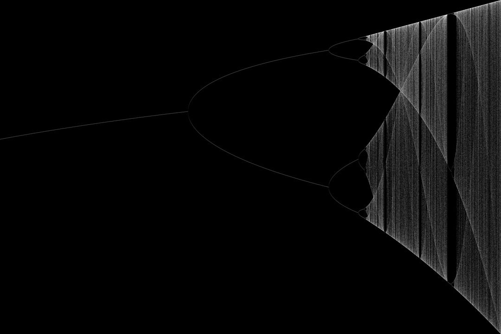

# bifurcate-rs
_Zero dependency images (of chaos) in Rust_

To run: `time cargo run --release > img.pgm`

To convert from PGM to PNG using Image Magick: `convert -resize 2160x1440 img.pgm img.png`

[Click here for a brief tutorial on underlying concepts (threads, PGM/PPM, ...)](https://state.smerity.com/smerity/state/01EYB6YQ5T2KFSC1PF55A3B8DG)
